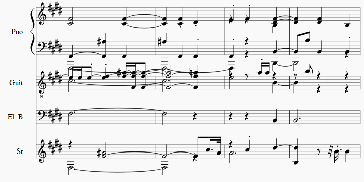

# Impromptu Accompaniment of Pop Music using Coupled Latent Variable Model with Binary Regularizer

This is the official PyTorch implementation of *Bijue Jia, et al. "Impromptu Accompaniment of Pop Music using Coupled Latent Variable Model with Binary Regularizer". Accepted by IJCNN 2019. We are currently preparing for final camera ready submission.*
(paper)([audio samples](https://jiabijue.github.io/track2tracks/))


## Directory Structure

```
.
├── data/
│   ├── lpd_5_cleansed/  (put the downloaded data here)
│   │   ├── A/...
│   │   ├── B/...
│   │   └── ...
│   ├── lpd_5_cleansed-piano_non_empty400bool/
│   │   ├── develop/
│   │   │   └── *.npy
│   │   ├── test/
│   │   │   └── *.npy
│   │   └── train/
│   │       └── *.npy
│   └── dir_to_npy.ipynb  (for preprocessing)
├── log/
│   └── lpd5pne400_CVAE_FreeBits256_BinaryRegularizer_Coupled/
│       └── model/
│           └── net_params_{epoch}.pth  (put the pretrained model file here)
├── static/  (files for online display)
├── main.py
├── index.html  (Webpage for display audio samples)
└── README.md

```

## Requirements

- torchvision==0.2.1
- torch==1.0.0
- matplotlib==3.0.2
- pypianoroll==0.5.0
- scipy==1.2.1
- numpy==1.15.4

## Instructions

- Download dataset

We use the [lpd-5-cleansed](https://salu133445.github.io/lakh-pianoroll-dataset/dataset) subset of `Lakh Pianoroll Dataset`.

- Preprocess

Details of preprocessing are in `data/dir_to_npy.ipynb`.

- Train

```shell
# Train on default arguments
python3 main.py --mode train

# Or...
python3 main.py --mode train --exp_name your_experiment_name
```

- Inference

```shell
# Generate on our pretrained model
python3 main.py --mode infer

# Or...
python3 main.py --mode infer --exp_name your_experiment_name --restore_epoch your_early_stopping_epoch
```

## Pretrained model

- [net_params_20.pth](https://drive.google.com/open?id=11NJ5fnlaIO_M3p-80UX0BiCRUcbqN_9X)
    - default configuration

### Attribution

If you use this code in your research, cite via the following BibTeX:
```
(I'll fill in the blanks here once our paper is published)
```